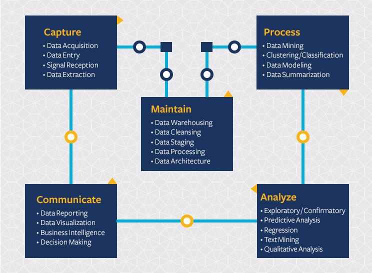

      
# What is Data Science?

## Data Science

```{r, echo = FALSE}
options(width = 75)
options(digits = 2)
# for sampling
set.seed(1234)
```

Data Science is still evolving. One definition 
by Hal Varian (Chief economist at Google and professor at UC Berkeley)
is:


### Data Science 
_The ability to take data -- to be able to understand it, to process it, to extract value from it, to visualize it, to communicate it -- that's going to be a hugely important skill in the next decades._ -- Hal Varian


## Data Science

{width=350px}

\tiny 
Source: <https://datascience.berkeley.edu/about/what-is-data-science/>

# Predictive Modeling

## Predictive Modeling

- Data mining

- Machine learning

- Prediction
    - regression (predict a number, e.g., the age of a person)
    - classification (predict a label, e.g., yes/no)

## Predictive Modeling Workflow

{width=350px}

## Predictive Modeling Workflow in R
{width=350px}

## Example

\small
```{r}
data(mtcars)    # Load the dataset
knitr::kable(head(mtcars))
```

\vfill
_Note_: `kable` in package `knitr` is used to pretty-print the table because the slides were created with Markdown.

## Example: Predict Miles per Gallon

```{r}
plot(mtcars$wt, mtcars$mpg)
```

## Linear Regression
\small
```{r}
model <- lm(mpg ~ wt, data = mtcars)
model
```

\vfill
### Formula Interface
R often uses a "model formula" to specify models of the from `response ~ predictors`. 
See `? formula` for details.

## Linear Regression: Model summary
\small
```{r}
summary(model)
```

## Linear Regression: The model as an R object

```{r}
str(model)
```

## Linear Regression: Plotting the regression line 
\footnotesize

```{r}
plot(mtcars$wt, mtcars$mpg)
abline(coef(model), col = "red", lty = 2, lwd = 3)
```

## Multiple Linear Regression
\footnotesize
```{r}
model <- lm(mpg ~ wt + cyl + hp, data = mtcars)
model
summary(model)
```


## Prediction
Almost all R models provide a `predict` function.
\vfill

```{r}
predict(model, head(mtcars))
```
\vfill

_Note:_ Prediction is typically done on new or test data. Package like
`caret` and `mlr3` and `Superlearner` help with this.


# Package Caret

## Train a model with Caret

\small

```{r}
library("caret")
# Simple linear regression model (lm means linear model)
model <- train(mpg ~ wt + cyl + hp,
               data = mtcars,
               method = "lm")
model
```

## Training a regression tree

\small


```{r}
# rpart implements CART (here a regression tree)
model <- train(mpg ~ wt + cyl + hp,
               data = mtcars,
               method = "rpart")
model
```

## Plotting a regression tree

\small

\btwocol


```{r out.height="50%"}
library(rpart.plot)
rpart.plot(model$finalModel)
```

```{r}
varImp(model)
```

\etwocol

# Exercises

## Exercises

1. Load the MLB data set and create a scatter plot of weight by height with a regression line added.
2. Create a prediction model that predicts weight using position, height, and age of
the player. Compare different models using caret.
3. Create a classification model to predict the position. Decide what information is useful for this task.